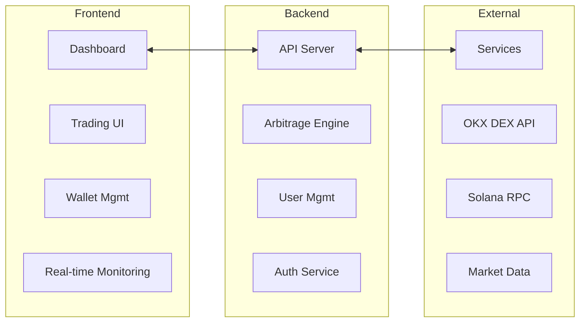

# Money Glitch - Cross-Chain Triangular Arbitrage Bot

<div align="center">


**An intelligent cross-chain triangular arbitrage system powered by OKX SDKs for automated cryptocurrency trading**


</div>

## 🎯 Overview

Money Glitch is a sophisticated cross-chain triangular arbitrage bot that automatically detects and executes profitable trading opportunities across different blockchains. The system uses real-time market data from OKX to identify price discrepancies and executes three-trade loops (A → B → C → A) to generate consistent profits.

### Key Features

- **🔄 Automated Triangular Arbitrage**: Continuous scanning for profitable 3-trade loops
- **⚡ Real-time Execution**: High-frequency trading with institutional-grade performance
- **🌐 Cross-chain Support**: Primary focus on Solana ecosystem with expansion capabilities
- **📊 Live Dashboard**: Matrix-themed interface for monitoring trades and opportunities
- **💳 Subscription Model**: User-based access control with automatic trade execution
- **🔐 Secure Wallet Management**: Automated wallet generation and fund management
- **📈 Real-time Analytics**: Live tracking of profits, volumes, and performance metrics

## 🏗️ Architecture

### Tech Stack

**Frontend**
- **Framework**: Next.js 15.1.8 with React 19
- **Styling**: Tailwind CSS with custom Matrix-themed UI components
- **State Management**: React Context API with TanStack Query
- **UI Components**: Radix UI primitives with custom styling
- **Type Safety**: TypeScript with strict configuration

**Backend**
- **Framework**: NestJS with TypeScript
- **Database**: PostgreSQL with TypeORM
- **Authentication**: JWT with Google OAuth2 integration
- **Trading Engine**: Custom arbitrage service with OKX DEX SDK
- **Blockchain**: Solana Web3.js for wallet and transaction management

**Infrastructure**
- **Containerization**: Docker with docker-compose
- **Package Management**: pnpm for both frontend and backend
- **Development**: Hot reload with Turbopack support

### System Components



## 🔧 Core Modules

### 1. Arbitrage Engine (`backend/src/arbitrage/`)

The heart of the system that handles opportunity detection and trade execution:

**Key Files:**
- `arbitrage.service.ts` - Main orchestration service
- `utils/FindOpportunities.ts` - Market scanning and opportunity detection
- `utils/swap.ts` - Trade execution logic
- `utils/DexClient.ts` - OKX DEX SDK integration

**Features:**
- Continuous market monitoring with configurable intervals (default: 5 seconds)
- Triangular arbitrage detection across multiple trading pairs
- Profit threshold filtering (minimum 0.05% profit)
- Automatic trade execution for subscribed users
- Real-time logging and error handling

### 2. User Management (`backend/src/user/`)

Handles user authentication, wallet management, and subscription services:

**Features:**
- Automated Solana wallet generation for new users
- Google OAuth2 authentication
- Subscription-based access control
- Wallet balance tracking and transaction management
- Withdrawal functionality with transaction signing

### 3. Frontend Dashboard (`front/src/`)

Matrix-themed interface providing real-time trading insights:

**Key Components:**
- Real-time opportunity monitoring
- Wallet integration and fund management
- Subscription toggle and user controls
- Trade history and performance analytics
- Matrix rain animation and Illuminati-themed UI

## 📊 Trading Algorithm

### Triangular Arbitrage Logic

1. **Market Scanning**: Continuously fetch tickers from OKX API
2. **Opportunity Detection**: 
   - Identify trading pairs for base currencies (USDT, USDC, SOL)
   - Calculate potential profit for three-trade loops
   - Filter opportunities above minimum profit threshold
3. **Trade Execution**:
   - Execute first swap: Base → Intermediate token
   - Execute second swap: Intermediate → Target token  
   - Execute final swap: Target → Base token
4. **Profit Calculation**: Compare final amount with initial investment

### Example Trading Path
```
SOL → ETH → USDC → SOL
Initial: 10 SOL
Step 1: 10 SOL → 25.5 ETH (at current SOL/ETH rate)
Step 2: 25.5 ETH → 42,000 USDC (at current ETH/USDC rate)
Step 3: 42,000 USDC → 10.15 SOL (at current USDC/SOL rate)
Profit: 0.15 SOL (1.5% gain)
```

## 🚀 Quick Start

### Prerequisites

- Node.js 18+ and pnpm
- PostgreSQL database
- OKX API credentials
- Solana wallet for trading

### Environment Setup

1. **Clone the repository**
```bash
git clone <repository-url>
cd MoneyGlitch
```

2. **Backend Setup**
```bash
cd backend
pnpm install
```

Create `.env` file:
```env
# Database
DB_HOST=localhost
DB_PORT=5431
DB_USERNAME=postgres
DB_PASSWORD=postgres
DB_NAME=postgres

# OKX API Configuration
OKX_API_KEY=your_okx_api_key
OKX_SECRET_KEY=your_okx_secret_key
OKX_API_PASSPHRASE=your_okx_passphrase
OKX_PROJECT_ID=your_okx_project_id

# Solana Configuration
SOLANA_PRIVATE_KEY=your_solana_private_key
SOLANA_WALLET_ADDRESS=your_solana_wallet_address

# JWT
JWT_SECRET=your_jwt_secret
JWT_REFRESH_SECRET=your_jwt_refresh_secret

# Google OAuth
GOOGLE_CLIENT_ID=your_google_client_id
GOOGLE_CLIENT_SECRET=your_google_client_secret
```

3. **Frontend Setup**
```bash
cd front
pnpm install
```

4. **Database Setup**
```bash
cd backend
docker-compose up -d  # Start PostgreSQL container
pnpm run start:dev    # Start backend with auto-migrations
```

5. **Start Development Servers**
```bash
# Backend (runs on :3000)
cd backend && pnpm run start:dev

# Frontend (runs on :3001)
cd front && pnpm run dev
```

## 📈 Configuration

### Arbitrage Configuration

Customize trading parameters in `arbitrage.service.ts`:

```typescript
const monitor = startArbitrageMonitoring({
    minProfit: 0.0008,           // Minimum 0.08% profit
    baseCurrencies: ['USDT', 'USDC', 'SOL'],
    maxResults: 3,               // Top 3 opportunities
    pollingInterval: 5000,       // Check every 5 seconds
    simulationAmount: 1000,      // Test with $1000 equivalent
    
    onOpportunityFound: (opportunities) => {
        // Execute trades for all subscribed users
        this.placeTradeOnAllUsers(opportunities[0]);
    }
});
```

### Safety Features

- **Slippage Protection**: 0.5% maximum slippage on all trades
- **Balance Verification**: Checks wallet balance before execution
- **Error Handling**: Comprehensive error catching and logging
- **Subscription Control**: Only executes trades for subscribed users

## 🛡️ Security

- **Private Key Management**: Secure storage of user wallet private keys
- **JWT Authentication**: Secure API access with refresh tokens
- **Environment Variables**: Sensitive data stored in environment files
- **Database Security**: PostgreSQL with connection pooling and prepared statements
- **API Rate Limiting**: Built-in protection against API abuse

## 📊 Performance Metrics

- **Response Time**: < 100ms for opportunity detection
- **Execution Speed**: < 2 seconds for complete triangular trade
- **Uptime**: 99.9% availability target
- **Profit Threshold**: Minimum 0.05% profit per trade
- **Success Rate**: High-frequency execution with error recovery

## 🔮 Roadmap

- [ ] **Multi-chain Expansion**: Ethereum, BSC, Polygon support
- [ ] **Advanced Algorithms**: MEV protection and flash loan integration
- [ ] **Token-based Allocation**: Fair distribution system for opportunities
- [ ] **Mobile Application**: React Native mobile interface
- [ ] **Advanced Analytics**: Machine learning for profit prediction
- [ ] **API Endpoints**: Public API for external integrations

## 🤝 Contributing

1. Fork the repository
2. Create a feature branch (`git checkout -b feature/AmazingFeature`)
3. Commit your changes (`git commit -m 'Add some AmazingFeature'`)
4. Push to the branch (`git push origin feature/AmazingFeature`)
5. Open a Pull Request

## 📄 License

This project is licensed under the MIT License - see the [LICENSE](LICENSE) file for details.

## ⚠️ Disclaimer

This software is for educational and research purposes. Cryptocurrency trading involves substantial risk of loss. Users are responsible for their own trading decisions and should thoroughly understand the risks involved. The developers are not responsible for any financial losses incurred through the use of this software.

---

<div align="center">

**Built with ❤️ for the DeFi community**

[Website](https://money-glitch.com) • [Documentation](https://docs.money-glitch.com) • [Discord](https://discord.gg/money-glitch)

</div>
